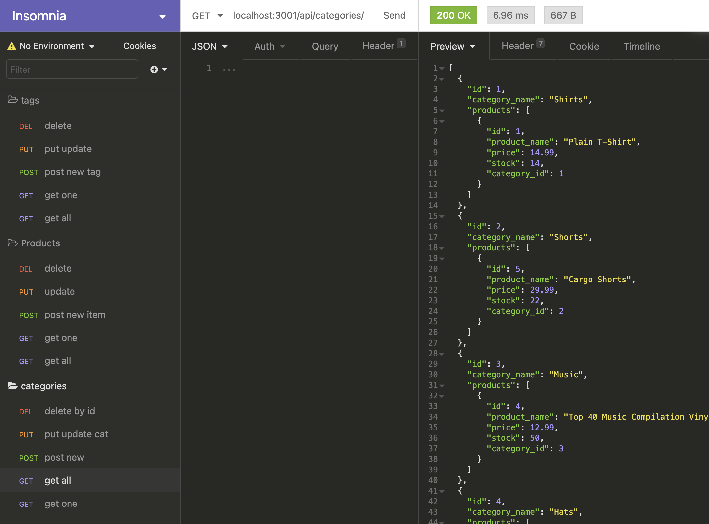
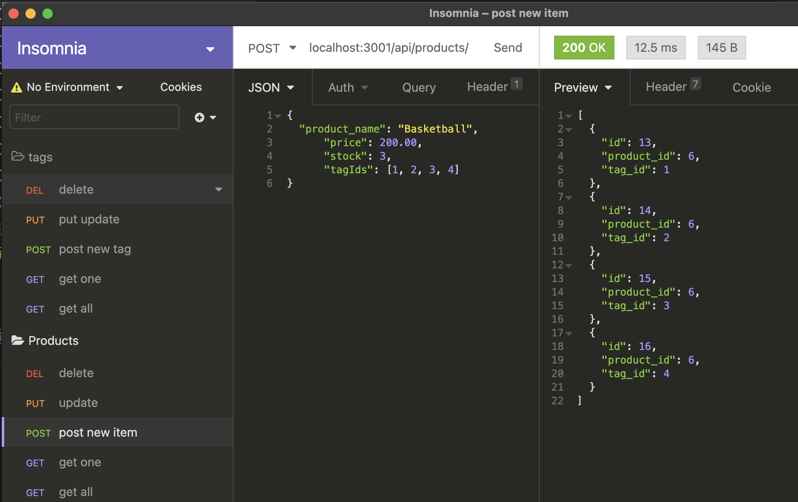
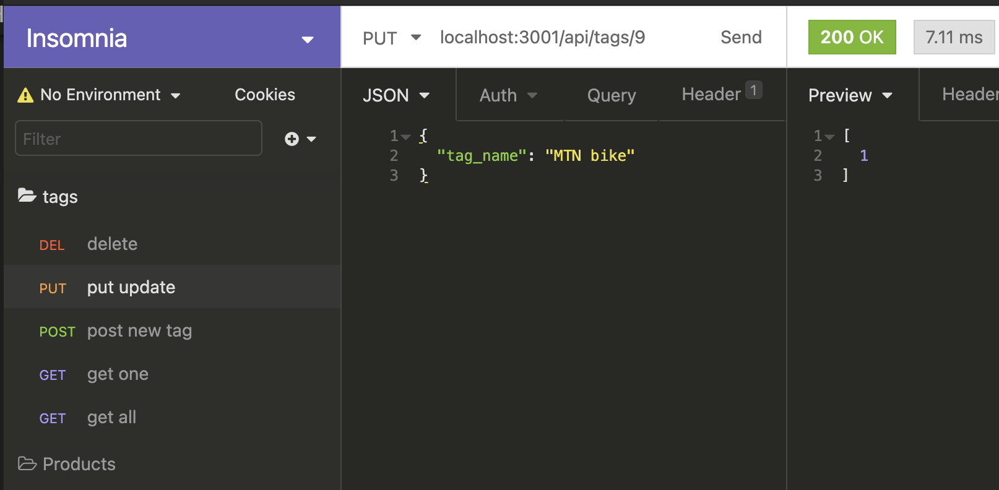

# E-Commerce-Back-End_ORM

# 13 Object-Relational Mapping (ORM): E-Commerce Back End

### demo video
https://drive.google.com/file/d/1PmXZffxoPoyW1G_RSYH9h2bpc_Npalzm/view?usp=sharing

## Your Task

Create an E-commerce platforms from the back end by modifying starter code. I configured a working Express.js API to use Sequelize to interact with a MySQL database.

## Acceptance Criteria

```md
GIVEN a functional Express.js API
WHEN I add my database name, MySQL username, and MySQL password to an environment variable file
THEN I am able to connect to a database using Sequelize
WHEN I enter schema and seed commands
THEN a development database is created and is seeded with test data
WHEN I enter the command to invoke the application
THEN my server is started and the Sequelize models are synced to the MySQL database
WHEN I open API GET routes in Insomnia Core for categories, products, or tags
THEN the data for each of these routes is displayed in a formatted JSON
WHEN I test API POST, PUT, and DELETE routes in Insomnia Core
THEN I am able to successfully create, update, and delete data in my database
```

## USAGE

* `Open mysql from the terminal`
- mysql -u root - p
- enter your mysql pw
Create database
- mysql create database e-commerce_db

* `In mysql workbench`
- refresh the database

* `In VSCode`
- run npm install
- run npm run seed
- run npm start 

* `In Insomnia` 
- run the routes and requests 

### Screenshots
* ORM get categories route

* ORM post products route
 
* ORM put tags route


### Database Models

The database contained the following four models, including the requirements listed for each model:

* `Category`

  * `id`

    * Integer.
  
    * Doesn't allow null values.
  
    * Set as primary key.
  
    * Uses auto increment.

  * `category_name`
  
    * String.
  
    * Doesn't allow null values.

* `Product`

  * `id`
  
    * Integer.
  
    * Doesn't allow null values.
  
    * Set as primary key.
  
    * Uses auto increment.

  * `product_name`
  
    * String.
  
    * Doesn't allow null values.

  * `price`
  
    * Decimal.
  
    * Doesn't allow null values.
  
    * Validates that the value is a decimal.

  * `stock`
  
    * Integer.
  
    * Doesn't allow null values.
  
    * Set a default value of `10`.
  
    * Validates that the value is numeric.

  * `category_id`
  
    * Integer.
  
    * References the `Category` model's `id`.

* `Tag`

  * `id`
  
    * Integer.
  
    * Doesn't allow null values.
  
    * Set as primary key.
  
    * Uses auto increment.

  * `tag_name`
  
    * String.

* `ProductTag`

  * `id`

    * Integer.

    * Doesn't allow null values.

    * Set as primary key.

    * Uses auto increment.

  * `product_id`

    * Integer.

    * References the `Product` model's `id`.

  * `tag_id`

    * Integer.

    * References the `Tag` model's `id`.

### Associations

Needed to execute association methods on the Sequelize models to create the following relationships between them:

* `Product` belongs to `Category`, and `Category` has many `Product` models, as a category can have multiple products but a product can only belong to one category.

* `Product` belongs to many `Tag` models, and `Tag` belongs to many `Product` models. Allow products to have multiple tags and tags to have many products by using the `ProductTag` through model.

### Fill Out the API Routes to Perform RESTful CRUD Operations

Filled out the unfinished routes in `product-routes.js`, `tag-routes.js`, and `category-routes.js` to perform create, read, update, and delete operations using your Sequelize models.

## Review

You are required to submit BOTH of the following for review:

* A walkthrough video demonstrating the functionality of the application and all of the acceptance criteria being met.

* The URL of the GitHub repository. Give the repository a unique name and include a readme describing the project.

